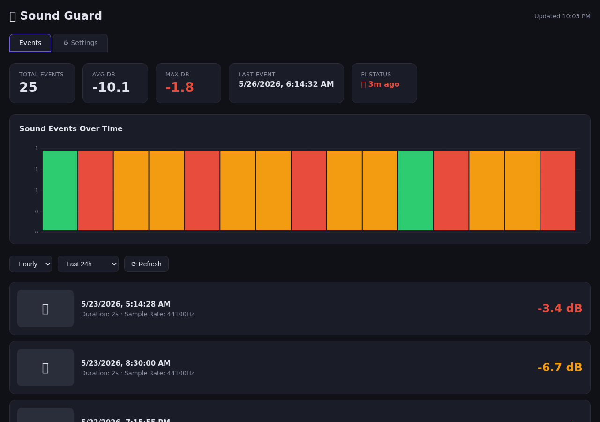
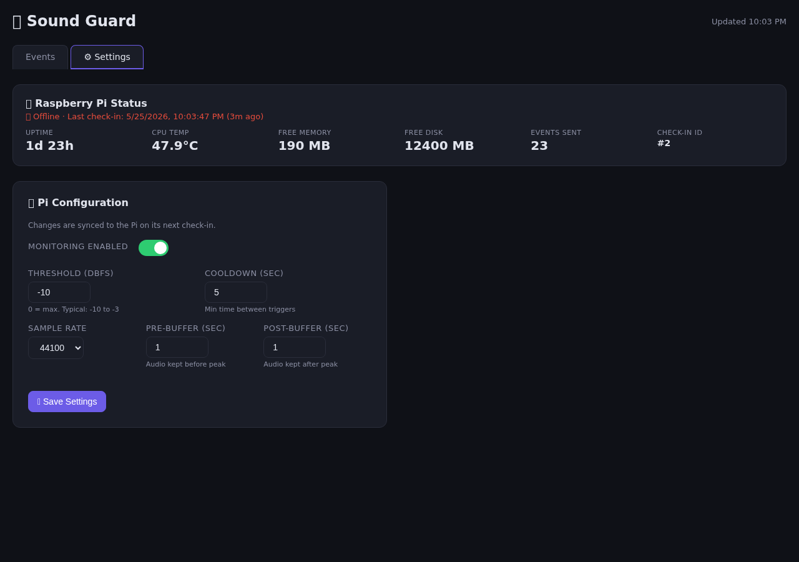

# 🔊 Pi Train Camera — Sound Guard

Audio monitoring system for Raspberry Pi. Listens to onboard mic, captures photos + audio clips on loud events, reports back to a dashboard server.

> **Rewrite of the original Django/Python version.** The old code lives on `main`. This branch (`rewrite`) uses Rust (client) + Node.js/Express (server) for better performance on Pi Zero.

## Screenshots

### Events Dashboard


### Pi Status & Remote Settings


## Architecture

- **Pi Zero (client):** Rust app — mic listener → peak detection → capture photo + audio clip → POST to server. Checks in every 60s with system stats and fetches remote settings.
- **Homelab (server):** Express + SQLite — receives events, serves dashboard with event list, metrics, Pi status, and remote config.

## Quick Start

### Pi Zero Install (one-liner)

```bash
curl -sL https://raw.githubusercontent.com/mhear22/pitraincamera/rewrite/install.sh | bash
```

That's it. It will:
1. Install Rust + system dependencies
2. Clone the repo and build the client for ARM
3. Install a systemd service (auto-starts on boot)
4. Start monitoring immediately

Customize before running:
```bash
# Point to your server (default: http://192.168.1.66:3002)
export SOUND_GUARD_SERVER=http://YOUR_SERVER:3002/api/events
# Adjust trigger threshold (default: -10 dBFS)
export SOUND_GUARD_THRESHOLD=-10
```

After install, settings can be changed from the dashboard — no Pi restart needed.

**Useful commands:**
```bash
sudo systemctl status sound-guard   # check status
sudo journalctl -u sound-guard -f   # live logs
sudo systemctl restart sound-guard  # restart after config edit
```

### Server

```bash
cd server
npm install
npm start        # runs on port 3002
```

Or via Docker:
```bash
docker compose up -d
```

## Microphone Options

The Pi Zero has **no onboard microphone**. You need one of these:

| Option | Price | Connection | Notes |
|---|---|---|---|
| **INMP441** | ~$5 | I2S (GPIO) | Best value. Low latency, 3 jumper wires |
| **SPH0645LM4H** | ~$10 | I2S (GPIO) | Higher quality I2S mic |
| **Cheap USB mic** | ~$10 | USB-C (OTG adapter) | Simplest setup, frees GPIO pins |
| **USB headset mic** | ~$20 | USB-C (OTG adapter) | Plug and play |

**Recommended:** INMP441 via I2S — cheap, low latency, doesn't use the USB port (keeps it free for power).

### Client (env vars)

| Variable | Default | Description |
|---|---|---|
| `SERVER_URL` | `http://192.168.1.66:3002/api/events` | Server endpoint |
| `THRESHOLD_DB` | `-10` | Trigger threshold (dBFS, 0 = max) |
| `COOLDOWN_SEC` | `5` | Min time between triggers |
| `SAMPLE_RATE` | `44100` | Audio sample rate |
| `PRE_BUFFER_SEC` | `1.0` | Audio kept before peak |
| `POST_BUFFER_SEC` | `1.0` | Audio kept after peak |

### Remote Settings (via dashboard)

Settings can be changed from the dashboard's **⚙️ Settings** tab. The Pi syncs on its next check-in (every 60s). No restart needed.

## Dashboard

Open `http://<server>:3002` for:
- **Events tab** — paginated event list with photos, audio playback, and dB chart
- **Settings tab** — Pi status (online/offline, CPU temp, uptime, memory, disk), remote config (threshold, cooldown, sample rate, buffers, enable/disable toggle)

## API Endpoints

| Method | Path | Description |
|---|---|---|
| `POST` | `/api/events` | Receive event from Pi (multipart: event JSON + audio + photo) |
| `GET` | `/api/events` | List events (paginated, filterable) |
| `GET` | `/api/events/:id` | Single event |
| `DELETE` | `/api/events/:id` | Delete event + files |
| `GET` | `/api/stats` | Summary stats |
| `GET` | `/api/metrics` | Hourly/daily aggregations |
| `POST` | `/api/checkin` | Pi check-in (stats) → returns settings |
| `GET` | `/api/checkin/latest` | Latest Pi check-in |
| `GET` | `/api/checkins` | Check-in history |
| `GET` | `/api/settings` | Current Pi settings |
| `PATCH` | `/api/settings` | Update Pi settings |

## Testing

```bash
# Server
cd server && npm test

# Client
cd client-rust && cargo test
```

## Original Version

The Django/Python version with `pyaudio` listener and Django REST Framework webapp is preserved on the `main` branch.
